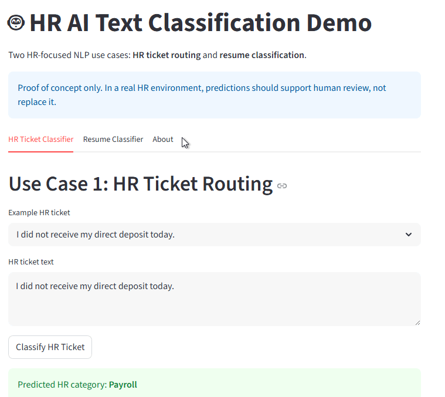
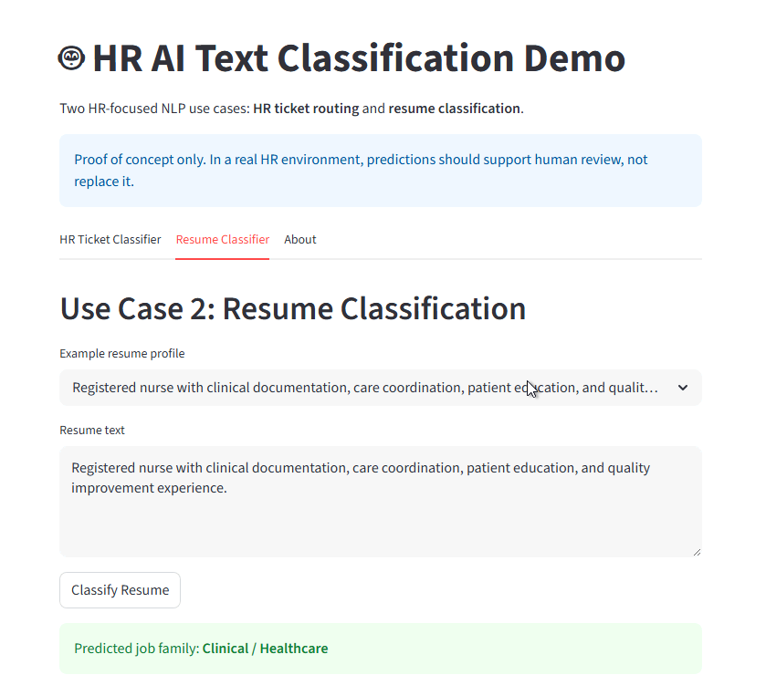

🤖 HR AI Text Classification Project

## 📸 Demo

### HR Ticket Routing

### Resume Classification

A Python, NLP, and Streamlit proof-of-concept that demonstrates how AI can support HR ticket routing and resume classification workflows.

🚀 Live Portfolio

👉 https://codehound1.github.io/hr-ai-text-classifier/

🧠 Project Overview

This project demonstrates how unstructured HR text can be converted into structured categories to support:

Ticket routing
Workflow automation
HR analytics
Decision support
💼 Use Cases
🔹 HR Ticket Classification

Classifies employee HR messages into:

Payroll
Benefits
Leave
IT Access
Recruiting
Employee Relations

Example:

"I did not receive my direct deposit today" → Payroll

🔹 Resume Classification

Classifies resume text into:

Data Analyst / Data Engineer
Human Resources
Clinical / Healthcare
Software Engineering
Finance / Accounting

Example:

"Epic Clarity analyst with SQL..." → Data Analyst / Data Engineer

🛠️ Tech Stack
Python
pandas
scikit-learn
TF-IDF Vectorization
Logistic Regression
Streamlit

⚙️ Run Locally
python -m pip install -r requirements.txt
python src/train_model.py
python src/train_resume_classifier.py
python -m streamlit run src/app.py

📊 Key Improvements (v4)
Expanded training datasets
Improved feature engineering (sublinear_tf=True)
Balanced class weighting
Confidence-based human review flag

⚠️ Responsible AI Note

This is a proof of concept. In real HR workflows, AI should support human decision-making, not replace it. Production use requires:

Bias testing
Fairness validation
Audit logging
Privacy & compliance controls
